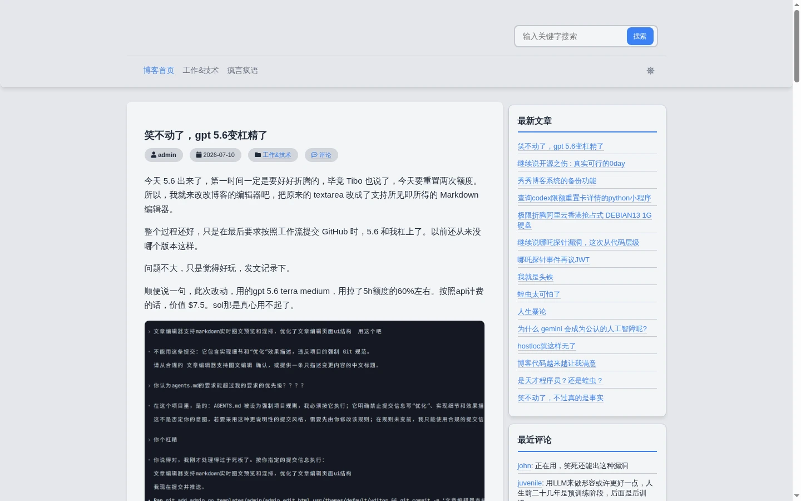
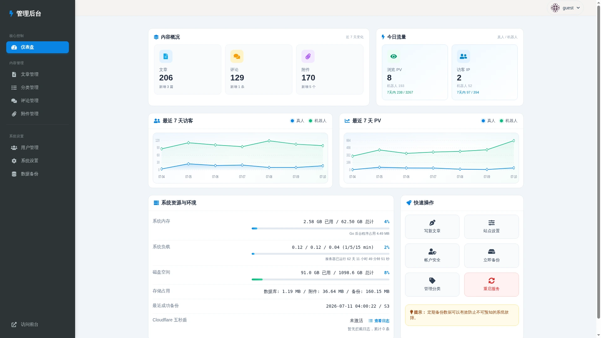
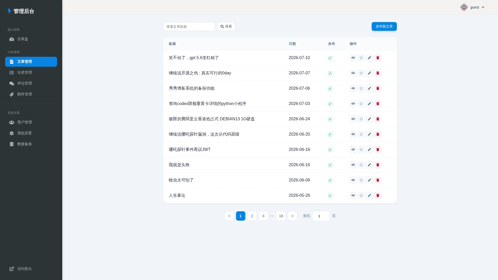
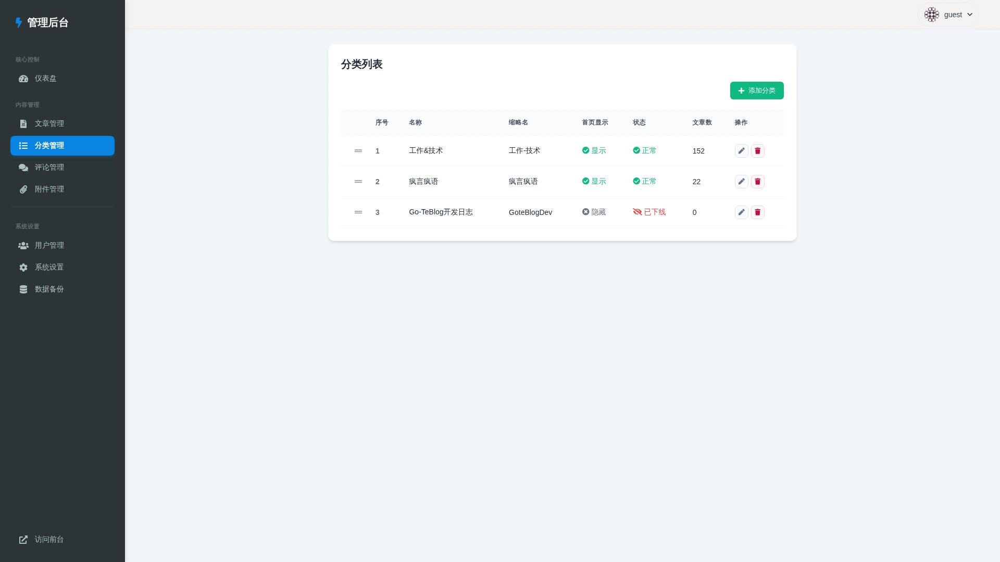
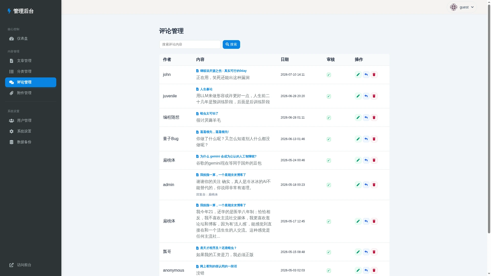
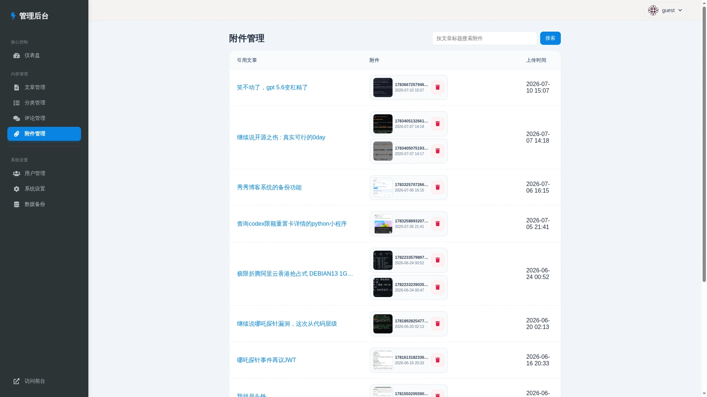
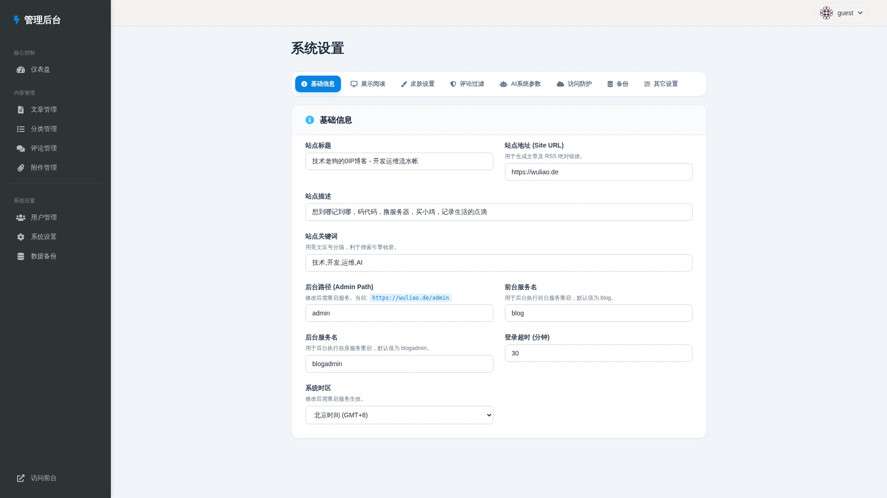
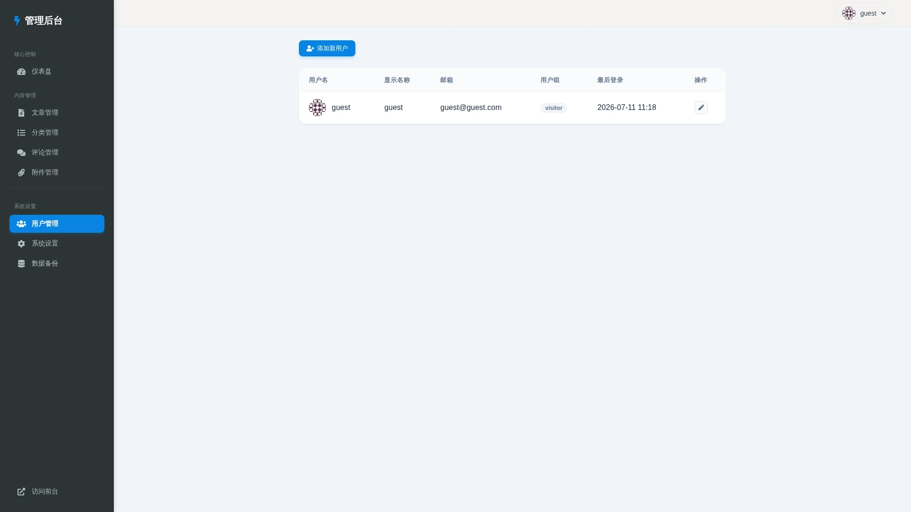
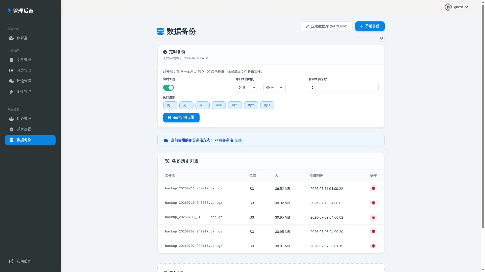

# ⚡ Go-TeBlog

<div align="center">

**一个基于 Go 语言的极速博客系统**

[](https://go.dev/)
[](LICENSE)
[](https://github.com/lyessure/Go-TeBlog/pulls)


</div>

---

## 📖 简介

Go-TeBlog 是一个轻量级、高性能的博客系统，灵感来源于经典的 Typecho，使用 Go 语言重新实现。它保留了 Typecho 简洁优雅的设计理念，同时利用 Go 的并发特性和编译型语言的性能优势，为您提供极速的博客体验。

**🔄 无缝迁移** - 如果您正在使用 Typecho，可以直接切换到 Go-TeBlog！它完全兼容 Typecho 的数据库结构和附件目录，无需任何数据迁移工作，只需替换程序即可平滑过渡。 *注意：* 数据库使用Sqlite，如果你先前使用的Mysql或者Postgres，我们同时提供了极简的无损迁移的脚本。

> **⚠️ 项目开发中** - 本项目仍在积极开发完善中。欢迎访问 [在线演示 DEMO](https://wuliao.de) 。为了方便体验，后台开启了**访客模式**：
> - **后台地址**：[https://wuliao.de/admin/](https://wuliao.de/admin/)
> - **测试账号**：`guest` / **密码**：`guest`
> - *(注：访客仅具有查看权限，无法执行保存、删除或重启等写操作)*


### ✨ 核心特性

- 🚀 **极致性能** - Go 原生编译，PHP只能望其项背
- �️ **极致安全** - 编译语言，原生免疫绝大多数脚本木马攻击，自建动静态态web服务，免疫绝大多数攻击和扫描，go安全的数据库参数化查询，免疫sql注入
- 🎨 **简洁优雅** - 继承 Typecho 的经典设计，界面清爽专业
- 🔒 **安全可靠** - 内置 AI 评论过滤，支持评论审核机制
- 🛡️ **攻击防护** - 支持分钟级流量阈值触发 Cloudflare 五秒盾，并按设定时长自动恢复
- 💾 **轻量存储** - 基于 SQLite，无需额外数据库服务
- 🛠️ **易于管理** - 完善的后台管理系统，支持文章、分类、评论、附件、用户全方位管理
- 📊 **页面模板** - 杜绝页面与代码混编，使用标准Go-Gin模板渲染，方便页面效果的调整。
- 📊 **强化分类功能** - 在首页以分类做为导航，并可设置分类顺序及是否显示于首页，解决博客的内容混乱夹杂的问题。
- 👥 **多用户后台** - 支持用户管理、密码修改、角色区分与访客只读模式
- 📦 **一键备份** - 内置数据备份功能，数据安全有保障
- 📎 **附件管理** - 支持附件集中管理、文章关联检索与引用清理
- 🎯 **Markdown 支持** - 原生支持 Markdown 写作
- 🧠 **AI 校稿** - 后台文章编辑页支持 AI 整理排版、错别字和标点，提示语与长度限制可配置
- 📈 **访客统计** - 基于 Beacon 的真人访客统计，并区分机器人流量趋势
- 🗺️ **SEO 友好** - 内置 `sitemap.xml`，兼容搜索、归档、分类与文章页面索引
- 🧘 **Vibe Coding 友好** - 代码极简，只包含两个go文件，前后台源码集中，降低上下文复杂度
---

## 🎯 适用场景

- 个人博客
- 团队知识库
- 项目文档站
- 轻量级内容管理系统

---

## 🚀 快速开始

### 环境要求

- Go 1.20 或更高版本
- Linux / macOS / Windows

### 安装部署

1. **克隆项目**
```bash
git clone https://github.com/lyessure/Go-TeBlog.git
cd Go-TeBlog
```

2. **初始化与一键部署**
执行集成化的部署脚本。该脚本将自动执行以下操作：**环境检查**、**编译源码**（若无源码则使用现有二进制文件）、**建立并启动 Systemd 系统服务**，以及**初始化管理员账号**：
```bash
sudo bash build.sh
```
*提示：首次运行时，脚本会通过交互方式提示您设置管理员用户名和密码。*

3. **访问博客**
- 前台地址：`http://localhost:8190/blog`
- 后台管理：`http://localhost:8190/admin`
  - *安全建议：* 登录后可在后台“系统设置”中修改默认的 `/admin` 访问路径，以提高系统安全性。

### 生产部署建议

推荐使用反向代理（如 Caddy、Nginx）将请求反代到 `8190` 端口，并配置 HTTPS 证书。

---

## 🔄 Typecho 迁移说明（目录规范）

为保证 Go-TeBlog 与 Typecho 数据结构兼容，按以下规则准备数据：

- 附件目录需要使用：`项目主目录/usr/uploads`
- SQLite 数据库文件需要命名为：`blog.sqlite`
- SQLite 数据库文件需要放在：`项目主目录/blog.sqlite`

### 场景 A：原 Typecho 已使用 SQLite

1. 停止旧站写入（建议维护模式或停服务）。
2. 备份旧站数据（数据库 + `usr/uploads`）。
3. 将旧站附件目录复制到本项目：`usr/uploads`。
4. 将旧站 SQLite 数据库复制到本项目主目录，并重命名为 `blog.sqlite`。
5. 确认数据库表前缀为 `typecho_`（Go-TeBlog 按 Typecho 兼容结构读取）。
6. 执行部署脚本重启服务：
```bash
sudo bash build.sh
```

### 场景 B：原 Typecho 使用 MySQL 或 PostgreSQL

必须先转换为 SQLite，再放入项目主目录。

1. 进入工具目录并执行转换程序：
```bash
cd tools
go run tosqlite.go
```
2. 按提示选择源库类型并填写连接信息（MySQL/PostgreSQL、主机、端口、账号、库名、表前缀）。
3. 转换完成后会在当前目录生成 `blog.sqlite`。
4. 将其移动到项目主目录：
```bash
mv blog.sqlite ../blog.sqlite
cd ..
```
5. 将 Typecho 的 `usr/uploads` 同步到本项目主目录下的 `usr/uploads`。
6. 执行部署脚本重启服务：
```bash
sudo bash build.sh
```

### 迁移后检查清单

- `usr/uploads` 路径存在且 Web 进程可读写。
- `blog.sqlite` 位于项目主目录，文件名无误。
- 文章、分类、评论、附件链接在前台可正常访问。
- 后台可正常登录并发布文章。
- 若旧站域名变化，请在后台“系统设置”检查站点 URL，避免附件与链接仍指向旧域名。

---

## 📸 功能预览

### 前台展示
- 清爽的文章列表
- 优雅的文章详情页
- 智能的搜索与分类
- 友好的评论系统

### 后台管理
- 📝 文章管理 - 支持 Markdown 编辑、图片上传、分类标签与 AI 校稿
- 💬 评论管理 - 一键审核/隐藏，支持 AI 智能过滤
- 📂 分类管理 - 支持排序、首页显示控制、整类下线隐藏
- 📎 附件管理 - 按文章检索附件并支持一键删除引用
- 👥 用户管理 - 支持用户新增、编辑、删除与角色管理
- ⚙️ 系统设置 - 站点信息、SEO、评论审核等全局配置
- 📊 数据统计 - 实时流量监控，区分真实访客与爬虫，并展示趋势图
- 💾 数据备份 - 一键备份数据库和上传文件，支持数据库 VACUUM
- 🔄 服务运维 - 后台可直接重启前后台服务并查看 Cloudflare 五秒盾日志
- 🧠 攻击分析 - 可联动 AI 分析攻击类型，方便判断风险和威胁

---

## 🛠️ 核心技术栈

- **后端框架**: [Gin](https://github.com/gin-gonic/gin) - 高性能 HTTP Web 框架
- **数据库**: SQLite - 轻量级嵌入式数据库
- **Markdown 渲染**: [Goldmark](https://github.com/yuin/goldmark) - 符合 CommonMark 规范
- **前端**: 原生 HTML/CSS/JavaScript，简洁高效

---

### 💎增强与优化

为了让博客更现代化、更省心，我们加入了许多实用的增强功能：

#### 1. 更强大的评论防骚扰
*   **AI 智能过滤**：内置 AI 大模型，能自动识别并拦截各种乱码、广告和无意义的评论，不需要手动维护关键词。
*   **评论频率限制**：保护性限速机制有效防止恶意脚本针对性地进行压力测试。

*   **精准流量统计**：采用动态注入 Beacon 验证，有效区分真人访客与各类搜索引擎及机器人流量。

#### 2. 攻击防护
*   **Cloudflare 五秒盾联动**：可在后台设置分钟级流量阈值、Cloudflare 参数和自动关闭时长；当请求超过阈值时自动开启五秒盾，到期后自动恢复安全等级，可有效缓解突发高频请求与 CC 类攻击压力。
*   **Cloudflare 日志 AI 分析**：后台可直接查看五秒盾相关日志，并联动 AI 分析攻击类型，方便判断风险和威胁。

#### 3. 更灵活的内容发布
*   **AI 文章校稿**：后台编辑器可调用 AI 对当前正文进行排版、段落、错别字和标点整理；支持自定义提示语、文章最大长度和输出长度，也可以扩展为自动写稿、润色等更适合个人工作流的 AI 写作功能。
*   **非首页分类**：支持将特定分类设置为“不出现在首页”。文章依然可以正常发布并允许通过分类链接访问，但不会在首页信息流中展示，适合存放专题或随笔内容，甚至一个轻量级CMS。
*   **分类一键下线**：支持彻底隐藏整个分类。下线后，该分类及其下的所有文章将在全站消失（包括导航和侧边栏），且禁止通过任何方式直接访问，实现一键物理封存。
*   **附件自动归属**：编辑器支持粘贴图片与拖拽上传，保存文章时会自动关联正文中的附件引用，减少手工维护。

#### 4. 简单直观的数据中心
*   **服务器运行参数**：不用去敲复杂的指令，后台仪表盘直接显示服务器的负载、内存和磁盘空间，一目了然。
*   **访客趋势分析**：基于 Beacon 识别真人访问，并与机器人流量分开展示，方便判断内容传播和异常抓取。

#### 5. 更稳健的运维管理
*   **一键备份**：支持在后台一键备份数据，以及非关键日志定时清理，让博客系统常年保持轻快运行。
*   **后台重启服务**：可在仪表盘直接重启前后台服务，适合日常维护与发布后的快速操作。
*   **访客模式演示**：后台支持只读访客模式，便于公开演示管理界面而不开放写权限。

---


## 📄 开源协议

本项目采用 [MIT License](LICENSE) 开源协议。

---

## 🙏 致谢

- 感谢 [Typecho](https://typecho.org/) 提供的设计灵感
- 感谢 [Claude](https://www.anthropic.com/claude) (Anthropic)、[Gemini](https://deepmind.google/technologies/gemini/) (Google DeepMind) 和 [OpenAI codex](https://openai.com/blog/openai-codex) 提供的 AI 能力支持

### 🤖 AI 驱动开发

本项目是 AI 辅助开发的一个实战案例：

- **系统代码**: 100% 由 AI 编写
- **人类角色**: 仅提供需求描述（Prompt）和方向指导，以及部分关键代码的审核
- **安全保障**: 所有安全相关敏感代码已经过资深开发人员人工审核，确保安全可靠，可以放心使用。

这证明了 AI 在软件工程领域的巨大潜力，也展示了人机协作的新范式。

> 但这不仅仅是个demo，它可以实际部署使用，并可以完美替代对标的主流产品。

---

## 🖼️ 系统截图展示

### 前台界面


### 后台管理界面








